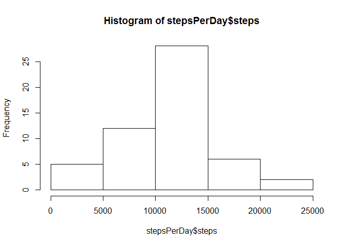
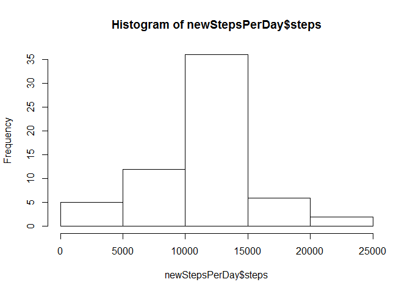

# Reproducible Research: Peer Assessment 1


## Loading and preprocessing the data

Load the data and transform date factor to proper format:


```r
activity <- read.csv("activity.csv")
activity$date <- as.Date(activity$date)
```


## What is mean total number of steps taken per day?


```r
stepsPerDay <- aggregate(steps~date, data = activity, sum)
hist(stepsPerDay$steps)
```

 

```r
meanSteps <- mean(stepsPerDay$steps)
medianSteps <- median(stepsPerDay$steps)
```
The average number of steps per day = 1.0766189\times 10^{4}  
The median number of steps per day = 10765  


## What is the average daily activity pattern?


```r
stepsPerInterval <- aggregate(steps~interval, data = activity, mean)
plot(stepsPerInterval, type = "l")
```

 

```r
maxStepsInterval <- stepsPerInterval[stepsPerInterval$steps == max(stepsPerInterval$steps), 1]
```
The interval with highest average steps per day = 835  


## Imputing missing values


```r
print(nrow(activity) - sum(complete.cases(activity)))
```

```
## [1] 2304
```

```r
newActivity <- activity
for (row in 1:nrow(newActivity)) {
    if (is.na(newActivity[row,]$steps)) {
        newActivity[row,]$steps <- stepsPerInterval[stepsPerInterval$interval == newActivity[row,]$interval,]$steps
    }
}

newStepsPerDay <- aggregate(steps~date, data = newActivity, sum)
hist(newStepsPerDay$steps)
```

 

```r
newMeanSteps <- mean(newStepsPerDay$steps)
newMedianSteps <- median(newStepsPerDay$steps)
```
The average number of steps per day when NA values are resolved = 1.0766189\times 10^{4}  
The median number of steps per day when NA values are resolved = 10765  


## Are there differences in activity patterns between weekdays and weekends?


```r
diffMean <- newMeanSteps - meanSteps
diffMedian <- newMedianSteps - medianSteps
```
The difference in average number of steps per day without and with NA values resolved = 0  
The difference in median number of steps per day without and with NA values resolved = 1.1886792  

